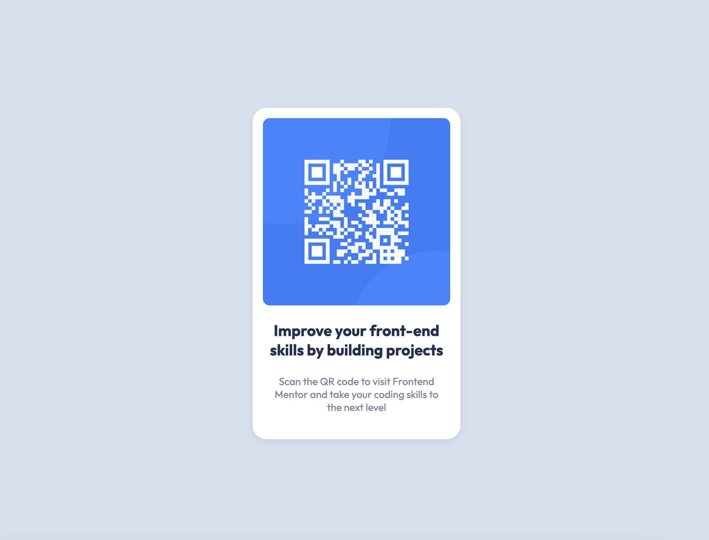

# Frontend Mentor - QR code component solution

This is a solution to the
[QR code component challenge on Frontend Mentor](https://www.frontendmentor.io/challenges/qr-code-component-iux_sIO_H).
Frontend Mentor challenges help you improve your coding skills by building
realistic projects.

## Table of contents

- [Frontend Mentor - QR code component solution](#frontend-mentor---qr-code-component-solution)
  - [Table of contents](#table-of-contents)
  - [Overview](#overview)
    - [Screenshot](#screenshot)
    - [Links](#links)
  - [My process](#my-process)
    - [Built with](#built-with)
    - [What I learned](#what-i-learned)
    - [Continued development](#continued-development)
  - [Author](#author)

**Note: Delete this note and update the table of contents based on what sections
you keep.**

## Overview

This was a basic challenge that I did for fun after signing up for frontend.io.

### Screenshot

### Links

- Live Site URL:
  [Add live site URL here](https://zev18.github.io/qr-code-component-main/)

## My process

This was a rather simple task. I simply started from the mobile layout, wrote
the basic html structure, set up my css variables, and then used flexbox to
achieve the desired result.

### Built with

- Semantic HTML5 markup
- CSS custom properties
- Flexbox
- Mobile-first workflow

### What I learned

This was all review for me. However, with tools like tailwind and react, I
almost never write vanilla HTML/CSS anymore. This exercise was a good refresher
on how to make sites the old fashioned way.

### Continued development

I think I will continue to use frontend.io to complete more difficult challenges
that will demonstrate my skills

## Author

- Github - [Zev18](https://github.com/zev18)
- Twitter - [@zev_ross](https://www.twitter.com/zev_ross)
- Frontend Mentor - [@zev18](https://www.frontendmentor.io/profile/zev18)
